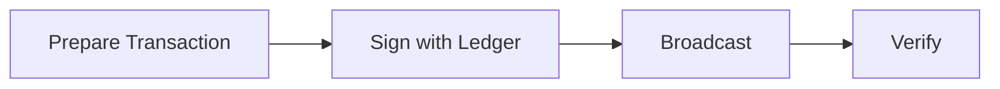
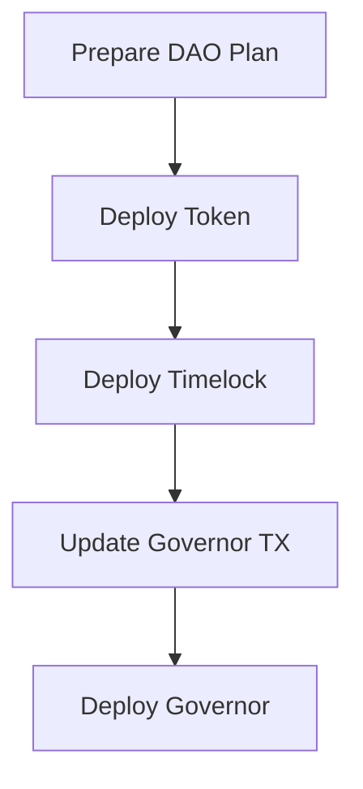

# DAO Deployer MCP Server

A **Model Context Protocol (MCP)** server that prepares DAO deployment transactions for secure external signing. Designed to work with the [MCP Ledger Server](https://github.com/crazyrabbitLTC/mcp-ledger-server) for hardware wallet security.

## 🎯 Two-Server Architecture

This system uses a **secure two-server architecture**:

1. **DAO Deployer MCP Server** (this repository)
   - Prepares deployment transactions
   - Validates parameters and estimates gas
   - Provides step-by-step deployment guidance

2. **MCP Ledger Server** ([separate repository](https://github.com/crazyrabbitLTC/mcp-ledger-server))
   - Handles hardware wallet connections
   - Signs transactions securely
   - Broadcasts to blockchain networks

### Why Two Servers?

✅ **Enhanced Security**: Hardware wallet logic is completely isolated  
✅ **Single Responsibility**: Each server has one clear purpose  
✅ **Better Maintenance**: Update deployment logic and signing logic independently  
✅ **Flexibility**: Swap signing methods without changing DAO logic  
✅ **Cleaner Architecture**: No mixed concerns or duplicated code  

## 🚀 Key Features

- 🏗️ **Transaction Preparation**: Prepares all DAO deployment transactions
- 🏛️ **Complete DAO Systems**: Factory, Token, Governor, and Timelock contracts
- 🌐 **Multi-Network Support**: 15+ networks including Ethereum, Polygon, Arbitrum, Base
- 📋 **Sequential Deployment**: Handles complex dependency chains between contracts
- 🔧 **Gas Estimation**: Accurate gas estimates with configurable multipliers
- ✅ **Contract Verification**: Integration with block explorer verification
- 🔑 **API Key Management**: Secure storage of blockchain service API keys
- 💰 **Ephemeral Wallets**: Temporary wallets for testnet deployments

## 📦 Installation

### Prerequisites

- **Node.js** >= 18.0.0
- **MCP Ledger Server** for secure signing
- **API Keys** for blockchain services (optional)

### Setup

```bash
# Install DAO Deployer MCP Server
git clone <this-repository>
cd dao-deployer/MCP\ Server
npm install
npm run build

# Install MCP Ledger Server (separate repository)
git clone https://github.com/crazyrabbitLTC/mcp-ledger-server
cd mcp-ledger-server
npm install
npm run build
```

### Claude Code Configuration

Add both servers to your Claude Code configuration:

```json
{
  "mcpServers": {
    "dao-deployer": {
      "command": "node",
      "args": ["/path/to/dao-deployer/MCP Server/build/index.js"]
    },
    "ledger": {
      "command": "node",
      "args": ["/path/to/mcp-ledger-server/build/index.js"]
    }
  }
}
```

## 🛠️ Core Tools

### Transaction Preparation Tools

#### `prepare-factory-deployment`
Prepares DAO factory deployment transaction for external signing.

```json
{
  "networkName": "sepolia",
  "factoryVersion": "v2",
  "verifyContract": true,
  "gasEstimateMultiplier": 1.2
}
```

#### `prepare-dao-deployment`
Prepares complete DAO deployment plan with three sequential transactions.

```json
{
  "networkName": "sepolia", 
  "factoryAddress": "0x...",
  "daoName": "My DAO",
  "tokenName": "My DAO Token",
  "tokenSymbol": "MDT",
  "initialSupply": "1000000000000000000000000",
  "governorSettings": {
    "votingDelay": 7200,
    "votingPeriod": 50400, 
    "proposalThreshold": "1000000000000000000000",
    "quorumPercentage": 10
  },
  "timelockSettings": {
    "minDelay": 86400,
    "proposers": ["0x..."],
    "executors": ["0x..."]
  }
}
```

### Monitoring Tools

#### `wait-for-confirmation`
Wait for transaction confirmation after signing with MCP Ledger Server.

#### `check-transaction-status`  
Check current status of any transaction.

### Utility Tools

#### `list-networks`
List all supported blockchain networks.

#### `verify-contract`
Verify deployed contracts on block explorers.

#### `get-deployment-info`
Get detailed information about deployed contracts.

## 🔄 Deployment Workflow

### 1. Factory Deployment



1. **Prepare**: Use `prepare-factory-deployment`
2. **Sign**: Use MCP Ledger Server to sign transaction
3. **Broadcast**: MCP Ledger Server broadcasts to network
4. **Monitor**: Use `wait-for-confirmation` to track progress

### 2. DAO Deployment



1. **Prepare**: Use `prepare-dao-deployment` (returns 3 transactions)
2. **Deploy Token**: Sign & broadcast token transaction
3. **Deploy Timelock**: Sign & broadcast timelock transaction  
4. **Update Governor**: Replace placeholder addresses in governor transaction
5. **Deploy Governor**: Sign & broadcast updated governor transaction

## 🔐 Security Model

### Transaction Preparation (This Server)
- ✅ Validates all deployment parameters
- ✅ Estimates gas costs accurately
- ✅ Provides clear deployment instructions
- ✅ No access to private keys or signing

### Secure Signing (MCP Ledger Server)
- ✅ Hardware wallet keys never leave device
- ✅ Transaction details displayed on device screen
- ✅ Physical confirmation required
- ✅ Isolated from deployment logic

### Benefits of Separation
- 🛡️ **Attack Surface**: Reduced by isolating signing logic
- 🔍 **Auditability**: Easier to audit each server independently  
- 🧪 **Testing**: Mock signing for development and testing
- 📈 **Scalability**: Add new signing methods without changing DAO logic

## 🌐 Supported Networks

### Mainnets
- Ethereum, Polygon, Arbitrum, Optimism, Base, Avalanche, BNB Chain

### Testnets  
- Sepolia, Holesky, Mumbai (deprecated), Fuji, BSC Testnet

## 🧪 Development

```bash
# Development mode with auto-rebuild
npm run dev

# Run comprehensive test suite
npm test

# Run integration tests
npm run test:integration

# Run E2E tests
npm run test:e2e

# Coverage report
npm run test:coverage
```

## 📊 Examples

### Example Factory Deployment

```json
{
  "tool": "prepare-factory-deployment",
  "arguments": {
    "networkName": "sepolia",
    "factoryVersion": "v2",
    "verifyContract": true
  }
}
```

**Result**: Prepared transaction ready for MCP Ledger Server signing.

### Example DAO Deployment

```json
{
  "tool": "prepare-dao-deployment", 
  "arguments": {
    "networkName": "sepolia",
    "factoryAddress": "0x1234...",
    "daoName": "Community DAO",
    "tokenName": "Community Token",
    "tokenSymbol": "COMM",
    "initialSupply": "1000000000000000000000000"
  }
}
```

**Result**: Three-step deployment plan with sequential transactions.

## 🤝 Integration with MCP Ledger Server

This server is designed to work seamlessly with the MCP Ledger Server:

1. **This Server** prepares transactions and provides instructions
2. **MCP Ledger Server** signs transactions with hardware wallet security
3. **Both** work together to provide a secure, user-friendly deployment experience

### Example Integration

```json
// 1. Prepare with DAO Deployer
{
  "server": "dao-deployer",
  "tool": "prepare-factory-deployment",
  "args": {"networkName": "sepolia"}
}

// 2. Sign with MCP Ledger Server  
{
  "server": "ledger",
  "tool": "sign_and_broadcast_transaction",
  "args": {"transaction": "0x...", "network": "sepolia"}
}

// 3. Monitor with DAO Deployer
{
  "server": "dao-deployer", 
  "tool": "wait-for-confirmation",
  "args": {"transactionHash": "0x...", "networkName": "sepolia"}
}
```

## 🔧 Configuration

### API Keys
Set blockchain service API keys for enhanced functionality:

```json
{
  "tool": "set-api-key",
  "keyName": "ALCHEMY_API_KEY", 
  "value": "your-api-key"
}
```

### Networks
All network configurations are built-in. Use `list-networks` to see available options.

### Gas Settings
Gas estimates include configurable multipliers for reliability:

```json
{
  "gasEstimateMultiplier": 1.2  // 20% buffer
}
```

## 📚 Documentation

### Quick Start
- Resource: `dao-deployer://docs/quickstart`
- Two-server workflow and basic examples

### Hardware Wallet Setup  
- Resource: `dao-deployer://docs/hardware-wallets`
- Comprehensive setup guide for both servers

### Network Requirements
- Resource: `dao-deployer://docs/network-requirements`
- Network-specific setup and requirements

### Templates
- Factory: `dao-deployer://templates/factory-deployment`
- DAO: `dao-deployer://templates/dao-deployment`

## 🛡️ Security Best Practices

1. **Use Hardware Wallets**: Always use MCP Ledger Server for mainnet deployments
2. **Verify Transactions**: Review all transaction details on hardware wallet screen
3. **Test First**: Deploy to testnets before mainnet
4. **Save Addresses**: Keep records of all deployed contract addresses
5. **Verify Contracts**: Use block explorer verification for transparency

## 🤔 Why Not Direct Integration?

You might wonder why we use two servers instead of direct hardware wallet integration:

### Problems with Direct Integration
- ❌ Mixed responsibilities (DAO logic + signing logic)
- ❌ Harder to maintain and update
- ❌ Duplicated signing code across projects  
- ❌ Security concerns from larger attack surface
- ❌ Difficult to test without actual hardware

### Benefits of Two-Server Architecture
- ✅ Single responsibility principle
- ✅ Easier independent updates
- ✅ Reusable signing infrastructure
- ✅ Better security isolation
- ✅ Mockable signing for testing
- ✅ Flexible signing methods

## 📈 Roadmap

- [ ] Support for additional governance patterns
- [ ] Integration with more hardware wallet types (via MCP Ledger Server)
- [ ] Advanced deployment templates
- [ ] Gas optimization recommendations
- [ ] Multi-signature support
- [ ] Deployment automation workflows

## 🤝 Contributing

1. Fork the repository
2. Create a feature branch
3. Add tests for new functionality  
4. Ensure all tests pass
5. Submit a pull request

## 📄 License

MIT License - see LICENSE file for details.

## 🔗 Related Projects

- [MCP Ledger Server](https://github.com/crazyrabbitLTC/mcp-ledger-server) - Hardware wallet signing
- [Claude Code](https://claude.ai/code) - AI-powered development environment
- [Model Context Protocol](https://modelcontextprotocol.io/) - Standard for AI tool integration

## 💬 Support

- **GitHub Issues**: Bug reports and feature requests
- **Documentation**: Check the built-in resources for guides
- **Integration Help**: See the MCP Ledger Server repository for signing issues

---

**Security Notice**: This server prepares transactions but never handles private keys. Always use the MCP Ledger Server or another secure signing method for actual transaction signing, especially on mainnet deployments.