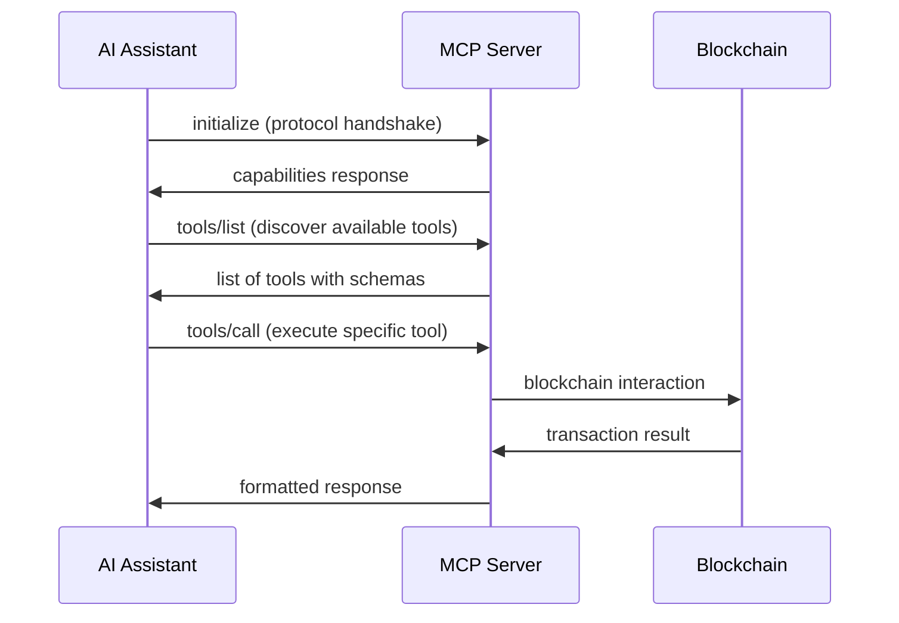
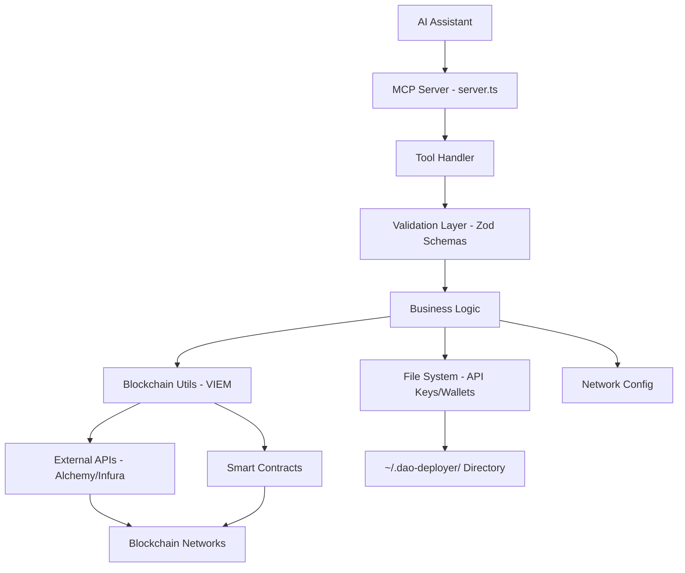

# MCP Server Testing Strategy & Architecture Documentation

## Table of Contents
1. [MCP Server Architecture Overview](#mcp-server-architecture-overview)
2. [Model Context Protocol (MCP) Fundamentals](#model-context-protocol-mcp-fundamentals)
3. [Project Structure & Component Interactions](#project-structure--component-interactions)
4. [Testing Strategy: Minimal Mocking Approach](#testing-strategy-minimal-mocking-approach)
5. [Implementation Plan](#implementation-plan)

## MCP Server Architecture Overview

### What is the Model Context Protocol (MCP)?

The Model Context Protocol is a standardized way for AI assistants to interact with external tools and resources. It defines a JSON-RPC based communication protocol that allows AI models to:

- **Discover available tools** via `tools/list` requests
- **Execute tools** via `tools/call` requests with validated parameters
- **Access resources** like files, databases, or APIs through standardized interfaces
- **Maintain state** across multiple tool invocations within a session

### Our DAO Deployer MCP Server

Our MCP server provides AI assistants with the ability to:

1. **Deploy DAO Infrastructure**: Create governance contracts, token contracts, and complete DAO systems
2. **Manage Blockchain Networks**: Support 15+ networks (Ethereum, Polygon, Arbitrum, etc.)
3. **Handle API Keys**: Securely store and manage API keys for blockchain providers
4. **Manage Ephemeral Wallets**: Generate temporary wallets for funding deployments
5. **Query Blockchain State**: Check balances, verify deployments, interact with contracts

## Model Context Protocol (MCP) Fundamentals

### JSON-RPC Communication Flow

The MCP protocol uses JSON-RPC 2.0 over stdio (standard input/output) for communication:



### Message Structure

**Initialize Message:**
```json
{
  "jsonrpc": "2.0",
  "id": 1,
  "method": "initialize",
  "params": {
    "protocolVersion": "2024-11-05",
    "capabilities": {},
    "clientInfo": {"name": "claude", "version": "1.0.0"}
  }
}
```

**Tool Call Message:**
```json
{
  "jsonrpc": "2.0",
  "id": 2,
  "method": "tools/call", 
  "params": {
    "name": "deploy-dao-factory",
    "arguments": {
      "networkName": "sepolia",
      "factoryType": "governor"
    }
  }
}
```

### Tool Schema Definition

Each tool has a JSON Schema that defines:
- **Input parameters** with types, validation rules, and descriptions
- **Required vs optional** parameters
- **Enum constraints** for network names, factory types, etc.

Example tool schema:
```typescript
{
  name: 'generate-ephemeral-wallet',
  description: 'Generate a temporary wallet with software-managed private key',
  inputSchema: {
    type: 'object',
    properties: {
      networkName: {
        type: 'string',
        description: 'Name of the blockchain network'
      }
    },
    required: ['networkName']
  }
}
```

## Project Structure & Component Interactions

### Directory Structure
```
MCP Server/
├── src/
│   ├── index.ts              # Entry point, process management
│   ├── server.ts             # Core MCP server implementation
│   ├── config/
│   │   ├── networks.ts       # Blockchain network configurations
│   │   └── contracts.ts      # Smart contract addresses/ABIs
│   ├── tools/               # MCP tool implementations
│   │   ├── deploy-dao-factory.ts
│   │   ├── manage-api-keys.ts
│   │   ├── manage-ephemeral-wallets.ts
│   │   └── list-networks.ts
│   ├── utils/               # Shared utilities
│   │   ├── blockchain.ts    # Blockchain interaction utilities
│   │   ├── ephemeral-wallet.ts # Wallet generation using VIEM
│   │   ├── api-key-manager.ts  # Secure API key storage
│   │   └── formatting.ts    # Response formatting utilities
│   └── resources/           # MCP resource handlers
│       └── index.ts         # File system resource access
├── build/                   # Compiled JavaScript output
├── docs/                    # Documentation
└── package.json            # Dependencies and scripts
```

### Component Interaction Flow



### Key Components

#### 1. MCP Server Core (`server.ts`)
- **Request Handling**: Processes JSON-RPC messages from AI assistant
- **Tool Registration**: Defines available tools and their schemas
- **Validation**: Uses Zod schemas to validate input parameters
- **Error Handling**: Standardized error responses with proper error codes
- **Response Formatting**: Converts internal results to user-friendly text

#### 2. Tool Implementations
Each tool follows a consistent pattern:

```typescript
// 1. Input schema definition with Zod
export const DeployDAOFactoryInputSchema = z.object({
  networkName: z.string().min(1),
  factoryType: z.enum(['governor', 'multisig']),
  deployerAddress: z.string().optional()
});

// 2. Tool implementation function
export async function deployDAOFactoryTool(
  input: z.infer<typeof DeployDAOFactoryInputSchema>
): Promise<DeploymentResult> {
  // Business logic implementation
}

// 3. Response formatting function  
export function formatDeploymentResult(result: DeploymentResult): string {
  // Convert result to user-friendly text
}
```

#### 3. Blockchain Integration (VIEM)
- **Wallet Management**: Secure private key generation and account creation
- **Transaction Handling**: Gas estimation, transaction submission, receipt polling
- **Contract Interaction**: Deploy contracts, call contract functions
- **Multi-Chain Support**: Dynamic network configuration and RPC management

#### 4. Security & Storage
- **API Key Management**: Encrypted storage in `~/.dao-deployer/api-keys.json`
- **Ephemeral Wallets**: Temporary private keys with restricted file permissions (0o600)
- **Input Validation**: Comprehensive validation of addresses, network names, parameters
- **Error Isolation**: Proper error boundaries to prevent information leakage

## Testing Strategy: Minimal Mocking Approach

### Philosophy: Test Real Implementations

Instead of mocking external dependencies, we use **real implementations in controlled test environments**:

- ✅ **Real MCP Protocol**: Test actual JSON-RPC communication
- ✅ **Real Blockchain**: Use local Anvil instances for deterministic testing  
- ✅ **Real File System**: Test in isolated temporary directories
- ✅ **Real APIs**: Use test credentials with actual API endpoints
- ✅ **Real Cryptography**: Test VIEM's actual implementations

### 1. MCP Protocol Integration Tests

Test the complete MCP communication flow by spawning the actual server:

```typescript
describe('MCP Protocol Integration', () => {
  let serverProcess: ChildProcess;
  
  beforeEach(async () => {
    // Start real MCP server
    serverProcess = spawn('node', ['build/index.js'], { 
      stdio: ['pipe', 'pipe', 'pipe'] 
    });
    
    // Wait for server startup
    await waitForServerReady(serverProcess);
  });
  
  it('should complete full tool execution flow', async () => {
    // 1. Initialize protocol
    const initResponse = await sendMCPMessage(serverProcess, {
      jsonrpc: '2.0',
      id: 1,
      method: 'initialize',
      params: {
        protocolVersion: '2024-11-05',
        capabilities: {},
        clientInfo: { name: 'test-client', version: '1.0.0' }
      }
    });
    
    expect(initResponse.result).toBeDefined();
    
    // 2. List available tools
    const toolsResponse = await sendMCPMessage(serverProcess, {
      jsonrpc: '2.0',
      id: 2, 
      method: 'tools/list'
    });
    
    expect(toolsResponse.result.tools).toContainEqual(
      expect.objectContaining({
        name: 'generate-ephemeral-wallet'
      })
    );
    
    // 3. Execute tool with validation
    const toolCallResponse = await sendMCPMessage(serverProcess, {
      jsonrpc: '2.0',
      id: 3,
      method: 'tools/call',
      params: {
        name: 'generate-ephemeral-wallet',
        arguments: { networkName: 'sepolia' }
      }
    });
    
    expect(toolCallResponse.result.content[0].text).toMatch(/Generated ephemeral wallet/);
  });
});
```

**Benefits:**
- Tests real protocol implementation, not mocks
- Validates complete request/response cycle
- Tests actual schema validation and error handling
- Verifies tool registration and discovery

### 2. Local Blockchain Testing with Anvil

Use Foundry's Anvil for deterministic blockchain testing:

```typescript
describe('Blockchain Operations', () => {
  let anvilProcess: ChildProcess;
  const TEST_RPC_URL = 'http://localhost:8545';
  
  beforeAll(async () => {
    // Start local blockchain with pre-funded accounts
    anvilProcess = spawn('anvil', [
      '--port', '8545',
      '--accounts', '10', 
      '--balance', '10000', // 10000 ETH per account
      '--gas-limit', '30000000'
    ]);
    
    await waitForAnvilReady();
  });
  
  it('should deploy DAO factory to local blockchain', async () => {
    const result = await callTool('deploy-dao-factory', {
      networkName: 'local-test',
      factoryType: 'governor',
      deployerAddress: ANVIL_ACCOUNT_0 // Pre-funded test account
    });
    
    // Verify deployment on actual blockchain
    expect(result.factoryAddress).toMatch(/^0x[a-fA-F0-9]{40}$/);
    expect(result.transactionHash).toMatch(/^0x[a-fA-F0-9]{64}$/);
    
    // Query blockchain state to verify deployment
    const code = await publicClient.getBytecode({
      address: result.factoryAddress as Address
    });
    expect(code).toBeDefined();
    expect(code.length).toBeGreaterThan(2); // More than just '0x'
  });
  
  it('should handle gas estimation and transaction failures', async () => {
    // Test with insufficient gas
    const result = await callTool('deploy-dao-factory', {
      networkName: 'local-test',
      factoryType: 'governor',
      gasLimit: '1000' // Intentionally too low
    });
    
    expect(result.success).toBe(false);
    expect(result.error).toContain('gas');
  });
});
```

**Benefits:**
- Tests against real blockchain mechanics (gas, consensus, state)
- Deterministic results with controlled environment
- No network latency or rate limiting
- Can simulate various blockchain conditions

### 3. File System Integration Testing

Test actual file operations in isolated environments:

```typescript
describe('File System Operations', () => {
  let testDir: string;
  
  beforeEach(() => {
    // Create isolated test directory
    testDir = mkdtempSync(join(tmpdir(), 'dao-deployer-test-'));
    
    // Override configuration for test
    process.env.DAO_DEPLOYER_DATA_DIR = testDir;
  });
  
  afterEach(() => {
    // Clean up test directory
    rimraf.sync(testDir);
  });
  
  it('should manage API keys with proper file permissions', async () => {
    const result = await callTool('set-api-key', {
      provider: 'alchemy',
      networkName: 'mainnet', 
      apiKey: 'test-api-key-12345'
    });
    
    expect(result.success).toBe(true);
    
    // Verify file was created with correct permissions
    const keyFile = join(testDir, 'api-keys.json');
    expect(existsSync(keyFile)).toBe(true);
    
    const stats = statSync(keyFile);
    expect(stats.mode & 0o777).toBe(0o600); // Only owner read/write
    
    // Verify content is properly encrypted
    const content = readFileSync(keyFile, 'utf8');
    expect(content).not.toContain('test-api-key-12345'); // Should be encrypted
  });
  
  it('should manage ephemeral wallet lifecycle', async () => {
    // Generate wallet
    const generateResult = await callTool('generate-ephemeral-wallet', {
      networkName: 'sepolia'
    });
    
    const walletAddress = extractAddressFromResult(generateResult);
    
    // List wallets
    const listResult = await callTool('list-ephemeral-wallets');
    expect(listResult.wallets).toContainEqual(
      expect.objectContaining({
        address: walletAddress,
        networkName: 'sepolia'
      })
    );
    
    // Delete wallet
    const deleteResult = await callTool('delete-ephemeral-wallet', {
      walletAddress,
      networkName: 'sepolia'
    });
    
    expect(deleteResult.success).toBe(true);
    
    // Verify file was removed
    const walletFiles = readdirSync(join(testDir, 'ephemeral-wallets'));
    expect(walletFiles).not.toContain(
      expect.stringMatching(walletAddress.slice(2)) // Remove 0x prefix
    );
  });
});
```

### 4. Property-Based Testing

Use fast-check to generate random inputs and test edge cases:

```typescript
import fc from 'fast-check';

describe('Property-Based Validation Tests', () => {
  it('should validate Ethereum addresses correctly', () => {
    fc.assert(fc.property(
      fc.hexaString({ minLength: 40, maxLength: 40 }),
      (hex) => {
        const address = '0x' + hex;
        const result = validateEthereumAddress(address);
        
        // Should match VIEM's validation
        expect(result).toBe(isAddress(address));
      }
    ));
  });
  
  it('should handle network name variations', () => {
    fc.assert(fc.property(
      fc.oneof(
        fc.constant('mainnet'),
        fc.constant('sepolia'), 
        fc.constant('polygon'),
        fc.string({ minLength: 1, maxLength: 20 }).filter(s => !/[^a-z0-9-]/.test(s))
      ),
      (networkName) => {
        const result = validateNetworkName(networkName);
        
        if (SUPPORTED_NETWORKS.includes(networkName)) {
          expect(result.valid).toBe(true);
        } else {
          expect(result.valid).toBe(false);
          expect(result.error).toContain('Unsupported network');
        }
      }
    ));
  });
  
  it('should handle transaction parameter edge cases', () => {
    fc.assert(fc.property(
      fc.record({
        gasLimit: fc.option(fc.nat({ max: 30000000 })),
        gasPrice: fc.option(fc.nat({ max: 1000000000000 })), // Up to 1000 gwei
        value: fc.option(fc.bigInt({ min: 0n, max: 10n ** 18n })) // Up to 1 ETH
      }),
      (txParams) => {
        const result = validateTransactionParams(txParams);
        
        // Should never throw, always return validation result
        expect(typeof result.valid).toBe('boolean');
        
        if (!result.valid) {
          expect(result.error).toBeDefined();
        }
      }
    ));
  });
});
```

### 5. End-to-End Workflow Testing

Test complete multi-step workflows:

```typescript
describe('Complete DAO Deployment Workflow', () => {
  it('should complete full deployment cycle with ephemeral wallet', async () => {
    // 1. Generate ephemeral wallet
    const walletResult = await callTool('generate-ephemeral-wallet', {
      networkName: 'sepolia'
    });
    
    const walletAddress = extractAddressFromResult(walletResult);
    
    // 2. Fund wallet (simulate by transferring from test account)
    await fundWalletFromTestAccount(walletAddress, '0.1'); // 0.1 ETH
    
    // 3. Verify wallet is funded
    const balanceResult = await callTool('check-wallet-balance', {
      walletAddress,
      networkName: 'sepolia'
    });
    
    expect(parseFloat(balanceResult.balance)).toBeGreaterThan(0.05);
    
    // 4. Deploy DAO factory using ephemeral wallet
    const deployResult = await callTool('deploy-dao-factory', {
      networkName: 'sepolia',
      factoryType: 'governor',
      deployerAddress: walletAddress
    });
    
    expect(deployResult.success).toBe(true);
    expect(deployResult.factoryAddress).toMatch(/^0x[a-fA-F0-9]{40}$/);
    
    // 5. Sweep remaining funds back to main account
    const sweepResult = await callTool('sweep-ephemeral-wallet', {
      walletAddress,
      recipientAddress: TEST_RECIPIENT_ADDRESS,
      networkName: 'sepolia',
      deleteKeyAfterSweep: true
    });
    
    expect(sweepResult.success).toBe(true);
    
    // 6. Verify wallet is deleted after sweep
    const listResult = await callTool('list-ephemeral-wallets');
    expect(listResult.wallets).not.toContainEqual(
      expect.objectContaining({ address: walletAddress })
    );
  });
});
```

## Implementation Plan

### Phase 1: Test Infrastructure Setup
1. **Configure Testing Framework**
   - Install Vitest with TypeScript support
   - Set up test scripts and configuration
   - Create test utilities and helpers

2. **Local Blockchain Environment**
   - Install Foundry/Anvil for local blockchain testing
   - Create network configuration for test environments
   - Set up test account management

3. **Environment Isolation**
   - Create test directory utilities
   - Set up environment variable overrides
   - Implement cleanup procedures

### Phase 2: Core Component Tests
1. **MCP Protocol Tests**
   - Server startup and communication tests
   - Tool registration and schema validation tests
   - Error handling and protocol compliance tests

2. **Blockchain Integration Tests**  
   - Contract deployment tests with Anvil
   - Transaction handling and gas estimation tests
   - Multi-network configuration tests

3. **File System Tests**
   - API key storage and encryption tests
   - Ephemeral wallet persistence tests
   - File permission and security tests

### Phase 3: Advanced Testing
1. **Property-Based Tests**
   - Input validation with random data generation
   - Edge case discovery with fast-check
   - Cryptographic operation validation

2. **End-to-End Workflow Tests**
   - Complete DAO deployment scenarios
   - Multi-step ephemeral wallet workflows
   - Error recovery and rollback testing

### Phase 4: Performance & Reliability
1. **Load Testing**
   - Concurrent tool execution tests
   - Resource usage monitoring
   - Memory leak detection

2. **Reliability Testing**
   - Network failure simulation
   - Partial failure recovery tests
   - Data consistency validation

This comprehensive testing strategy ensures high confidence in the MCP server's functionality while maintaining minimal mocking by using real implementations in controlled test environments.