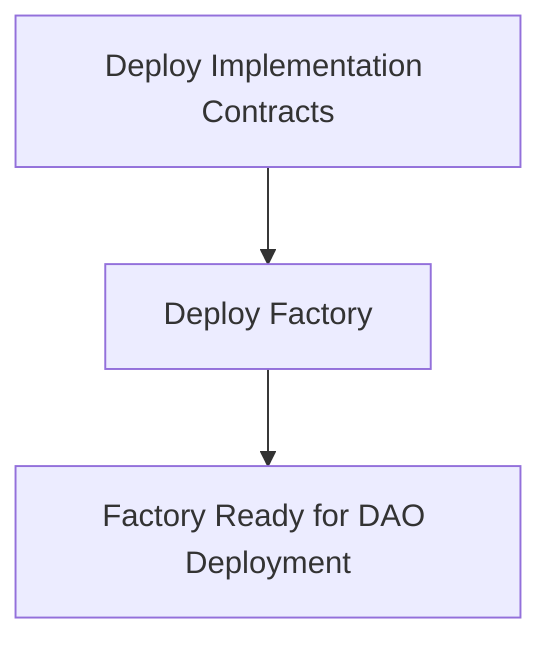
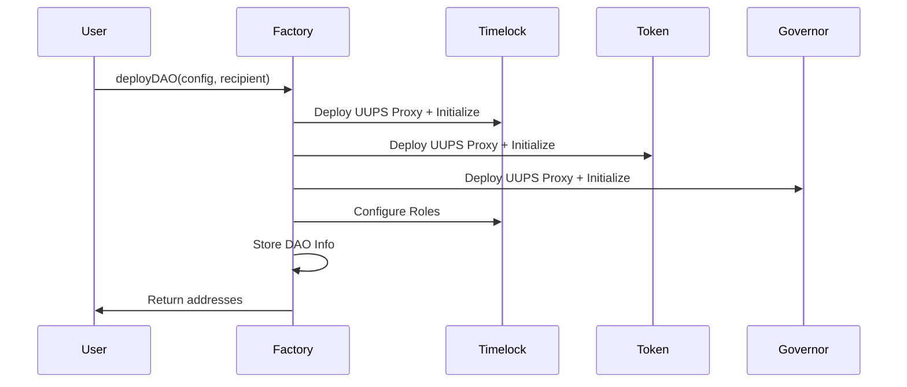
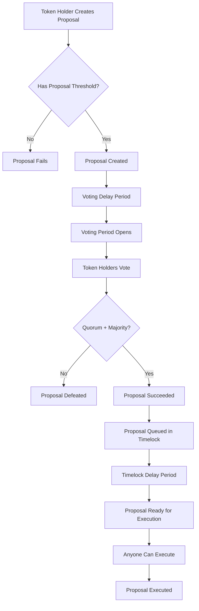
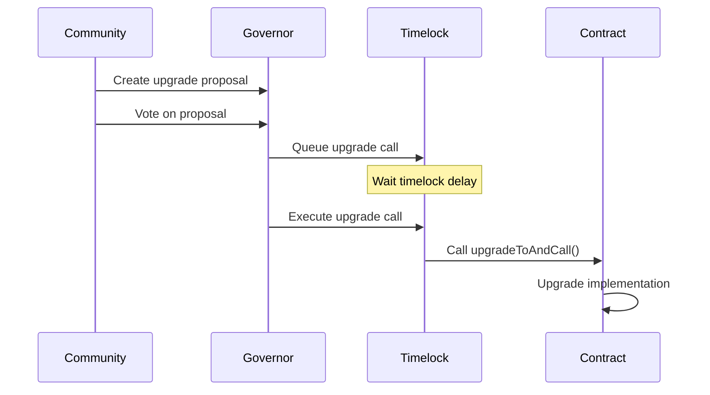
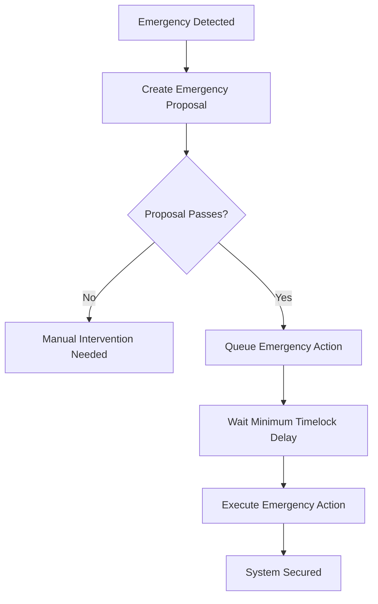
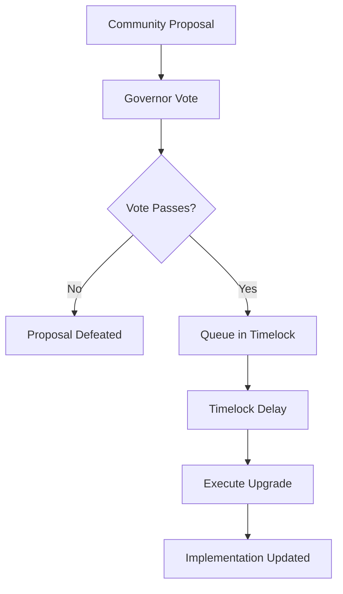

# Smart Contract System Documentation

## Table of Contents
- [System Overview](#system-overview)
- [Architecture](#architecture)
- [Contract Specifications](#contract-specifications)
- [Deployment Lifecycle](#deployment-lifecycle)
- [Events Reference](#events-reference)
- [Functions Reference](#functions-reference)
- [Governance Workflows](#governance-workflows)
- [Frontend Integration Guide](#frontend-integration-guide)
- [Security Model](#security-model)
- [Upgrade Patterns](#upgrade-patterns)

## System Overview

The DAO Deployment System is a comprehensive smart contract infrastructure for creating fully sovereign, upgradeable DAOs with complete governance capabilities.

### Key Features
- **True DAO Sovereignty**: Each DAO controls all its own upgrades
- **Deterministic Deployment**: Same addresses across all networks using CREATE2
- **UUPS Upgrade Pattern**: Secure, governance-controlled upgrades
- **Complete Governance Stack**: Token, Governor, and Timelock integration
- **Cross-Chain Support**: Deploy identical systems on multiple networks

### Contracts Overview
1. **SimpleDAOFactoryV2**: Factory for deploying DAO systems
2. **SimpleDAOTokenUpgradeable**: ERC20 governance token with voting
3. **SimpleDAOGovernorUpgradeable**: Governor for proposal management
4. **SimpleDAOTimelockUpgradeable**: Timelock for secure execution

## Architecture

### Proxy Pattern: UUPS (Universal Upgradeable Proxy Standard)
```
┌─────────────────┐    ┌─────────────────┐
│   ERC1967Proxy  │───▶│  Implementation │
│   (User calls)  │    │   (Logic code)  │
└─────────────────┘    └─────────────────┘
```

### DAO System Architecture
```
┌──────────────────┐
│     Factory      │──┐
└──────────────────┘  │
                      │ Deploys
                      ▼
┌─────────────────────────────────────────┐
│              DAO System                 │
│ ┌─────────┐ ┌─────────┐ ┌─────────────┐ │
│ │  Token  │ │Governor │ │  Timelock   │ │
│ │ (UUPS)  │ │ (UUPS)  │ │   (UUPS)    │ │
│ └─────────┘ └─────────┘ └─────────────┘ │
└─────────────────────────────────────────┘
```

### Upgrade Authority Flow
```
Timelock ──┐
           ├──> Controls All Upgrades
           │    ├─ Token Upgrades
           │    ├─ Governor Upgrades  
           │    └─ Timelock Upgrades (Self)
           │
           └──> Governance Proposals ──> Community Vote
```

## Contract Specifications

### SimpleDAOFactoryV2

**Purpose**: Deploy complete DAO systems with deterministic addresses

**Key Properties**:
- Uses CREATE2 for deterministic deployment
- Stores implementation addresses immutably
- No ongoing control after deployment
- Tracks deployed DAOs for discovery

**Constructor Parameters**:
```solidity
constructor(
    address tokenImpl,      // Token implementation address
    address governorImpl,   // Governor implementation address  
    address timelockImpl    // Timelock implementation address
)
```

**State Variables**:
```solidity
address public immutable tokenImplementation;
address public immutable governorImplementation;
address public immutable timelockImplementation;

DeployedDAO[] public allDAOs;
mapping(address => DeployedDAO[]) public daosByDeployer;
mapping(address => uint256) public daosByDeployerCount;
```

### SimpleDAOTokenUpgradeable

**Purpose**: ERC20 governance token with voting capabilities

**Inheritance Chain**:
- Initializable
- ERC20Upgradeable  
- ERC20PermitUpgradeable
- ERC20VotesUpgradeable
- OwnableUpgradeable
- UUPSUpgradeable

**Key Features**:
- Vote delegation and checkpointing
- Permit functionality for gasless approvals
- Minting capability (owner only)
- UUPS upgradeability with timelock authorization

**State Variables**:
```solidity
address public upgradeAuthority;  // Timelock address
```

### SimpleDAOGovernorUpgradeable

**Purpose**: Proposal creation and voting management

**Inheritance Chain**:
- Initializable
- GovernorUpgradeable
- GovernorSettingsUpgradeable
- GovernorCountingSimpleUpgradeable
- GovernorVotesUpgradeable
- GovernorVotesQuorumFractionUpgradeable
- GovernorTimelockControlUpgradeable
- GovernorStorageUpgradeable
- UUPSUpgradeable

**Key Features**:
- Proposal lifecycle management
- Vote counting and quorum calculation
- Timelock integration
- Settings management (voting delay, period, threshold)
- UUPS upgradeability

**State Variables**:
```solidity
address public upgradeAuthority;  // Timelock address
```

### SimpleDAOTimelockUpgradeable

**Purpose**: Secure execution delay and access control

**Inheritance Chain**:
- Initializable
- TimelockControllerUpgradeable
- UUPSUpgradeable

**Key Features**:
- Time-delayed execution
- Role-based access control
- Proposal queuing and execution
- Self-upgrade capability
- Emergency functions

**Roles**:
- `PROPOSER_ROLE`: Can queue operations (Governor)
- `EXECUTOR_ROLE`: Can execute operations (Public)
- `DEFAULT_ADMIN_ROLE`: Can manage roles (Self)

## Deployment Lifecycle

### 1. Factory Deployment


**Steps**:
1. Deploy `SimpleDAOTokenUpgradeable` implementation
2. Deploy `SimpleDAOGovernorUpgradeable` implementation  
3. Deploy `SimpleDAOTimelockUpgradeable` implementation
4. Deploy `SimpleDAOFactoryV2` with implementation addresses

### 2. DAO Deployment Process



**Detailed Steps**:

#### Step 1: Input Validation
```solidity
// Validate DAO configuration
require(bytes(config.tokenName).length > 0, "Token name cannot be empty");
require(bytes(config.tokenSymbol).length > 0, "Token symbol cannot be empty");
require(config.initialSupply > 0, "Initial supply must be greater than 0");
require(config.quorumPercentage > 0 && config.quorumPercentage <= 100, "Invalid quorum percentage");
```

#### Step 2: Timelock Deployment
```solidity
// Deploy timelock with UUPS proxy
address timelock = address(new ERC1967Proxy(
    timelockImplementation,
    abi.encodeCall(
        SimpleDAOTimelockUpgradeable.initialize,
        (timelockDelay, proposers, executors, factory)
    )
));
```

#### Step 3: Token Deployment  
```solidity
// Deploy token with UUPS proxy
address token = address(new ERC1967Proxy(
    tokenImplementation,
    abi.encodeCall(
        SimpleDAOTokenUpgradeable.initialize,
        (tokenName, tokenSymbol, initialSupply, recipient, timelock, timelock)
    )
));
```

#### Step 4: Governor Deployment
```solidity
// Deploy governor with UUPS proxy
address governor = address(new ERC1967Proxy(
    governorImplementation,
    abi.encodeCall(
        SimpleDAOGovernorUpgradeable.initialize,
        (governorName, token, timelock, votingDelay, votingPeriod, proposalThreshold, quorumPercentage, timelock)
    )
));
```

#### Step 5: Permission Configuration
```solidity
// Configure timelock roles
timelockContract.grantRole(PROPOSER_ROLE, governor);     // Governor can propose
timelockContract.grantRole(ADMIN_ROLE, timelock);       // Timelock self-governs
timelockContract.renounceRole(ADMIN_ROLE, factory);     // Factory loses control
```

#### Step 6: DAO Registration
```solidity
// Store DAO information
DeployedDAO memory dao = DeployedDAO({
    token: token,
    governor: governor,
    timelock: timelock,
    deployer: msg.sender,
    name: config.tokenName,
    timestamp: block.timestamp
});

allDAOs.push(dao);
daosByDeployer[msg.sender].push(dao);
```

### 3. Post-Deployment State

After deployment, each DAO is fully sovereign:
- **Token**: Owned by timelock, upgrades authorized by timelock
- **Governor**: Upgrades authorized by timelock  
- **Timelock**: Self-governing, upgrades authorized by self
- **Factory**: No ongoing control or upgrade capabilities

## Events Reference

### Factory Events

#### DAODeployed
```solidity
event DAODeployed(
    address indexed deployer,    // Account that deployed the DAO
    address indexed token,       // Token proxy address
    address indexed governor,    // Governor proxy address
    address timelock,           // Timelock proxy address
    string name                 // DAO name
);
```

**Usage**: Emitted when a new DAO is successfully deployed
**Frontend**: Use to track deployments and build DAO registry

### Token Events

#### Transfer (ERC20)
```solidity
event Transfer(
    address indexed from,
    address indexed to,
    uint256 value
);
```

#### DelegateChanged (ERC20Votes)
```solidity
event DelegateChanged(
    address indexed delegator,
    address indexed fromDelegate,
    address indexed toDelegate
);
```

#### DelegateVotesChanged (ERC20Votes)
```solidity
event DelegateVotesChanged(
    address indexed delegate,
    uint256 previousBalance,
    uint256 newBalance
);
```

### Governor Events

#### ProposalCreated
```solidity
event ProposalCreated(
    uint256 proposalId,
    address proposer,
    address[] targets,
    uint256[] values,
    string[] signatures,
    bytes[] calldatas,
    uint256 voteStart,
    uint256 voteEnd,
    string description
);
```

#### VoteCast
```solidity
event VoteCast(
    address indexed voter,
    uint256 proposalId,
    uint8 support,
    uint256 weight,
    string reason
);
```

#### ProposalQueued
```solidity
event ProposalQueued(
    uint256 proposalId,
    uint256 eta
);
```

#### ProposalExecuted
```solidity
event ProposalExecuted(
    uint256 proposalId
);
```

#### ProposalCanceled
```solidity
event ProposalCanceled(
    uint256 proposalId
);
```

### Timelock Events

#### CallScheduled
```solidity
event CallScheduled(
    bytes32 indexed id,
    uint256 indexed index,
    address target,
    uint256 value,
    bytes data,
    bytes32 predecessor,
    uint256 delay
);
```

#### CallExecuted
```solidity
event CallExecuted(
    bytes32 indexed id,
    uint256 indexed index,
    address target,
    uint256 value,
    bytes data
);
```

#### CallSalt
```solidity
event CallSalt(
    bytes32 indexed id,
    bytes32 salt
);
```

## Functions Reference

### Factory Functions

#### deployDAO
```solidity
function deployDAO(
    DAOConfig calldata config,
    address recipient
) external returns (
    address token,
    address governor,
    address timelock
)
```

**Purpose**: Deploy a complete DAO system
**Access**: Public
**Returns**: Addresses of deployed contracts

**Parameters**:
```solidity
struct DAOConfig {
    string tokenName;          // Name of governance token
    string tokenSymbol;        // Symbol of governance token  
    uint256 initialSupply;     // Initial token supply (18 decimals)
    uint256 votingDelay;       // Blocks before voting starts
    uint256 votingPeriod;      // Blocks for voting duration
    uint256 proposalThreshold; // Tokens needed to create proposal
    uint256 quorumPercentage;  // % of total supply for quorum
    uint256 timelockDelay;     // Seconds for timelock delay
}
```

#### View Functions
```solidity
function getDAOCount() external view returns (uint256)
function getAllDAOs() external view returns (DeployedDAO[] memory)
function getDAOsByDeployer(address deployer) external view returns (DeployedDAO[] memory)
function getTokenImplementation() external view returns (address)
function getGovernorImplementation() external view returns (address)
function getTimelockImplementation() external view returns (address)
```

### Token Functions

#### Core ERC20
```solidity
function transfer(address to, uint256 amount) external returns (bool)
function transferFrom(address from, address to, uint256 amount) external returns (bool)
function approve(address spender, uint256 amount) external returns (bool)
function balanceOf(address account) external view returns (uint256)
function totalSupply() external view returns (uint256)
```

#### Governance Functions
```solidity
function delegate(address delegatee) external
function delegateBySig(address delegatee, uint256 nonce, uint256 expiry, uint8 v, bytes32 r, bytes32 s) external
function getCurrentVotes(address account) external view returns (uint256)
function getPriorVotes(address account, uint256 blockNumber) external view returns (uint256)
```

#### Minting (Owner Only)
```solidity
function mint(address to, uint256 amount) external onlyOwner
```

#### Upgrade Functions
```solidity
function upgradeToAndCall(address newImplementation, bytes memory data) external payable
```

### Governor Functions

#### Proposal Management
```solidity
function propose(
    address[] memory targets,
    uint256[] memory values,
    bytes[] memory calldatas,
    string memory description
) external returns (uint256)

function queue(uint256 proposalId) external returns (uint256)
function execute(uint256 proposalId) external payable returns (uint256)
function cancel(uint256 proposalId) external returns (uint256)
```

#### Voting
```solidity
function castVote(uint256 proposalId, uint8 support) external returns (uint256)
function castVoteWithReason(uint256 proposalId, uint8 support, string calldata reason) external returns (uint256)
function castVoteBySig(uint256 proposalId, uint8 support, uint8 v, bytes32 r, bytes32 s) external returns (uint256)
```

#### View Functions
```solidity
function state(uint256 proposalId) external view returns (ProposalState)
function proposalVotes(uint256 proposalId) external view returns (uint256 againstVotes, uint256 forVotes, uint256 abstainVotes)
function hasVoted(uint256 proposalId, address account) external view returns (bool)
function proposalThreshold() external view returns (uint256)
function proposalSnapshot(uint256 proposalId) external view returns (uint256)
function proposalDeadline(uint256 proposalId) external view returns (uint256)
```

### Timelock Functions

#### Operation Management
```solidity
function schedule(
    address target,
    uint256 value,
    bytes calldata data,
    bytes32 predecessor,
    bytes32 salt,
    uint256 delay
) external onlyRole(PROPOSER_ROLE)

function execute(
    address target,
    uint256 value,
    bytes calldata data,
    bytes32 predecessor,
    bytes32 salt
) external payable onlyRole(EXECUTOR_ROLE)

function cancel(bytes32 id) external onlyRole(PROPOSER_ROLE)
```

#### View Functions
```solidity
function isOperation(bytes32 id) external view returns (bool)
function isOperationPending(bytes32 id) external view returns (bool)
function isOperationReady(bytes32 id) external view returns (bool)
function isOperationDone(bytes32 id) external view returns (bool)
function getTimestamp(bytes32 id) external view returns (uint256)
function getMinDelay() external view returns (uint256)
```

## Governance Workflows

### 1. Standard Proposal Workflow



### 2. Upgrade Proposal Workflow



### 3. Emergency Response Workflow



## Frontend Integration Guide

### 1. Contract Discovery

**Get Factory Address**:
```javascript
// Same address on all networks due to CREATE2
const FACTORY_ADDRESS = "0x[deterministic-address]";
```

**Get All DAOs**:
```javascript
const factory = new ethers.Contract(FACTORY_ADDRESS, factoryAbi, provider);
const allDAOs = await factory.getAllDAOs();
```

**Get User's DAOs**:
```javascript
const userDAOs = await factory.getDAOsByDeployer(userAddress);
```

### 2. DAO Interaction Patterns

**Initialize Contracts**:
```javascript
const token = new ethers.Contract(dao.token, tokenAbi, provider);
const governor = new ethers.Contract(dao.governor, governorAbi, provider);
const timelock = new ethers.Contract(dao.timelock, timelockAbi, provider);
```

**Check Voting Power**:
```javascript
const votingPower = await token.getCurrentVotes(userAddress);
const totalSupply = await token.totalSupply();
const votingPercentage = votingPower.mul(100).div(totalSupply);
```

**Create Proposal**:
```javascript
const tx = await governor.propose(
    targets,      // Contract addresses to call
    values,       // ETH values to send
    calldatas,    // Encoded function calls
    description   // Proposal description
);
const receipt = await tx.wait();
const proposalId = receipt.events[0].args.proposalId;
```

**Vote on Proposal**:
```javascript
// 0 = Against, 1 = For, 2 = Abstain
await governor.castVote(proposalId, 1);
```

### 3. Event Listening

**Watch for New DAOs**:
```javascript
factory.on("DAODeployed", (deployer, token, governor, timelock, name) => {
    console.log(`New DAO deployed: ${name}`);
    // Update UI with new DAO
});
```

**Watch for Proposals**:
```javascript
governor.on("ProposalCreated", (proposalId, proposer, targets, values, signatures, calldatas, voteStart, voteEnd, description) => {
    // Update proposal list
});
```

**Watch for Votes**:
```javascript
governor.on("VoteCast", (voter, proposalId, support, weight, reason) => {
    // Update vote counts
});
```

### 4. State Management

**Proposal States**:
```javascript
const ProposalState = {
    0: "Pending",
    1: "Active", 
    2: "Canceled",
    3: "Defeated",
    4: "Succeeded",
    5: "Queued",
    6: "Expired",
    7: "Executed"
};
```

**Track Proposal Lifecycle**:
```javascript
async function getProposalInfo(proposalId) {
    const state = await governor.state(proposalId);
    const votes = await governor.proposalVotes(proposalId);
    const snapshot = await governor.proposalSnapshot(proposalId);
    const deadline = await governor.proposalDeadline(proposalId);
    
    return {
        state: ProposalState[state],
        forVotes: votes.forVotes,
        againstVotes: votes.againstVotes,
        abstainVotes: votes.abstainVotes,
        snapshot,
        deadline
    };
}
```

### 5. Transaction Building

**Upgrade Transaction Example**:
```javascript
// Build upgrade call data
const newImplementation = "0x[new-implementation-address]";
const upgradeCalldata = token.interface.encodeFunctionData(
    "upgradeToAndCall",
    [newImplementation, "0x"]
);

// Create proposal
await governor.propose(
    [token.address],                    // targets
    [0],                               // values
    [upgradeCalldata],                 // calldatas
    "Upgrade token to v2.0"           // description
);
```

## Security Model

### 1. Access Control Matrix

| Contract | Function | Access Control |
|----------|----------|----------------|
| Factory | deployDAO | Public |
| Token | mint | Owner (Timelock) |
| Token | upgradeToAndCall | Upgrade Authority (Timelock) |
| Governor | upgradeToAndCall | Upgrade Authority (Timelock) |
| Timelock | upgradeToAndCall | Self (through governance) |
| Timelock | schedule | Proposer Role (Governor) |
| Timelock | execute | Executor Role (Public) |

### 2. Upgrade Authorization Flow



### 3. Attack Vector Mitigations

**Factory Takeover**: Factory has no ongoing control after deployment
**Upgrade Attacks**: All upgrades require governance approval + timelock delay
**Vote Manipulation**: Voting power based on token ownership with delegation
**Flash Loan Attacks**: Vote checkpoints prevent same-block manipulation
**Admin Key Risks**: No single admin keys; all control distributed through governance

### 4. Emergency Procedures

**Pause Functionality**: Not implemented by default (can be added via upgrade)
**Emergency Upgrades**: Still require full governance process
**Role Revocation**: Timelock can modify its own roles through governance

## Upgrade Patterns

### 1. Implementation Upgrade Process

```solidity
// 1. Deploy new implementation
NewImplementation newImpl = new NewImplementation();

// 2. Create governance proposal
bytes memory upgradeCall = abi.encodeWithSignature(
    "upgradeToAndCall(address,bytes)",
    address(newImpl),
    ""  // Optional initialization data
);

// 3. Submit proposal through governance
governor.propose(
    [address(targetContract)],
    [0],
    [upgradeCall],
    "Upgrade to new implementation"
);
```

### 2. Storage Layout Considerations

**Safe Additions**:
```solidity
contract V2 {
    // V1 storage (never modify)
    mapping(address => uint256) public balances;
    uint256 public totalSupply;
    
    // V2 additions (safe to add)
    uint256 public newFeature;
    mapping(address => bool) public newMapping;
}
```

**Unsafe Modifications**:
```solidity
// DON'T DO THIS - breaks storage layout
contract V2BadExample {
    uint256 public newFeature;        // Breaks V1 storage
    mapping(address => uint256) public balances;  // Storage slot collision
}
```

### 3. Upgrade Testing Checklist

- [ ] Storage layout compatibility verified
- [ ] All existing functions work correctly
- [ ] New functionality properly tested
- [ ] Access controls maintained
- [ ] Events properly emitted
- [ ] Integration with other contracts verified

## Gas Optimization Notes

### Deployment Costs
- Factory deployment: ~1.5M gas
- DAO deployment: ~7M gas total
  - Token: ~2.5M gas
  - Governor: ~3M gas  
  - Timelock: ~1.5M gas

### Operation Costs
- Token transfer: ~65k gas
- Proposal creation: ~300k gas
- Vote casting: ~80k gas
- Proposal execution: Variable (depends on operations)

### Optimization Strategies
- Batch operations where possible
- Use multicall for complex interactions
- Consider gasless voting via signatures
- Implement efficient storage patterns

---

*This documentation is maintained alongside the smart contract system. Update when contracts change.*